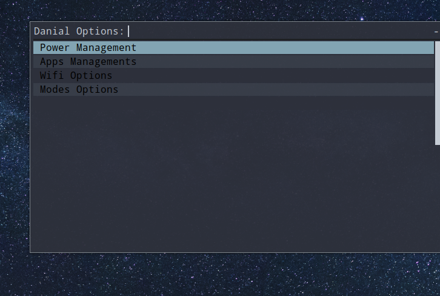

# Minimalist Rofi Bash Menu 

Bash script for daily usage of computer 
### Features : 
- Turn power off , On and lock machine 
- Wifi Manage
- Mode management 
- Update System packages 
- Update System Display Manager

### Examples :
#### App Menu


#### Menu


#### Wifi Menu


#### Power Menu


### Installation 
#### Linux
```sh 
git clone https://github.com/Danialdev01/Danial-Rofi-Bash-Menu &&
cd Danial-Rofi-Bash-Menu &&
chmod +x danial-menu-manager && chmod +x power-menu && chmod +x rofi-wifi-menu &&
sudo mv danial-menu-manager /usr/bin && sudo mv power-menu /usr/bin && sudo mv rofi-wifi-menu /usr/bin
```
### Dependencies
- rofi 
- nmcli

### Usages :
just connect to normal operating system keybinding then use as normal 
